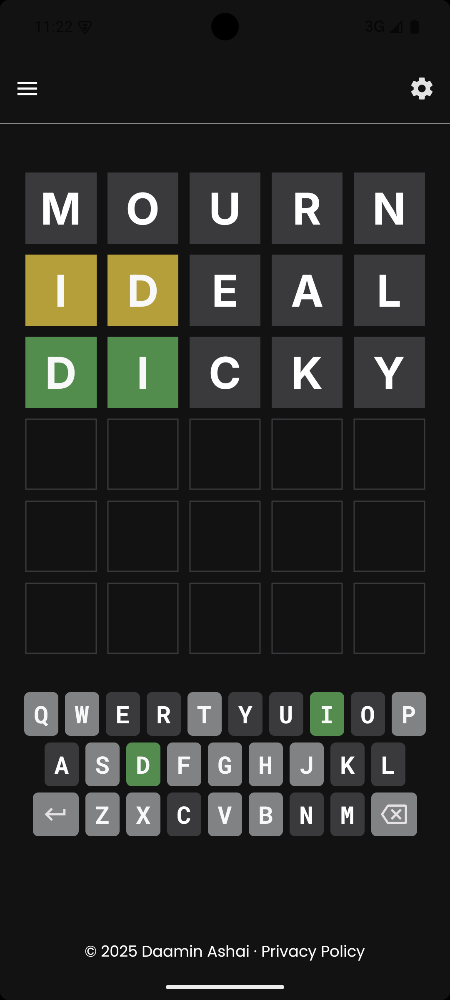
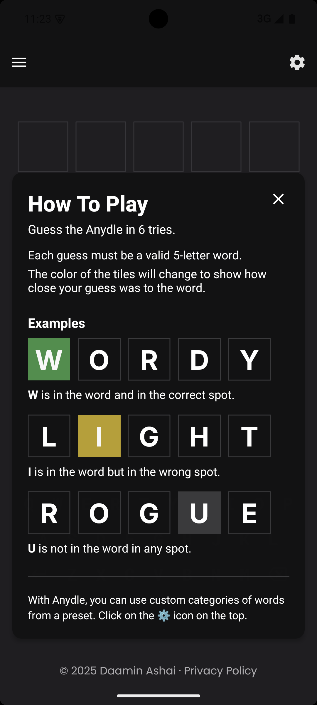
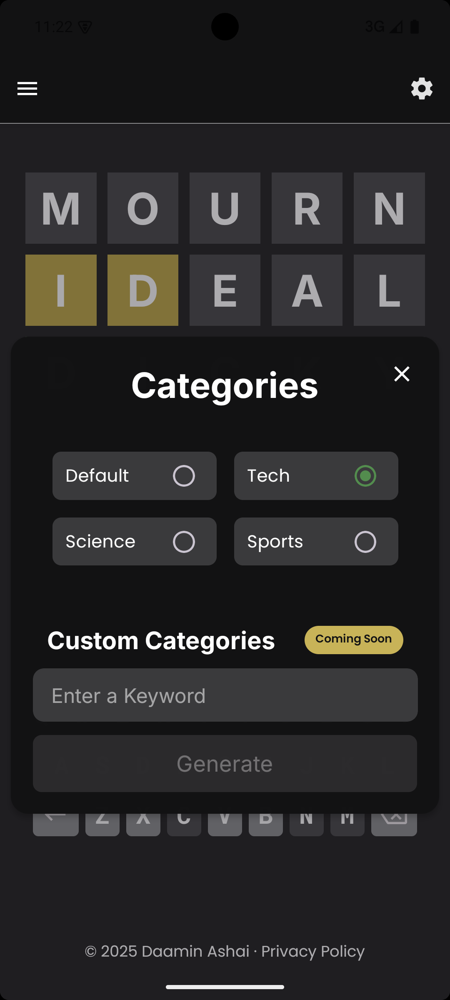
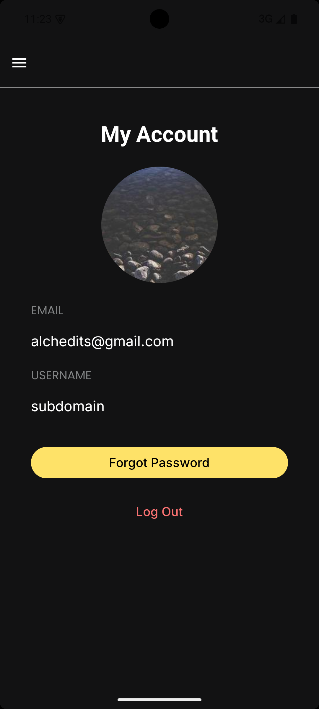
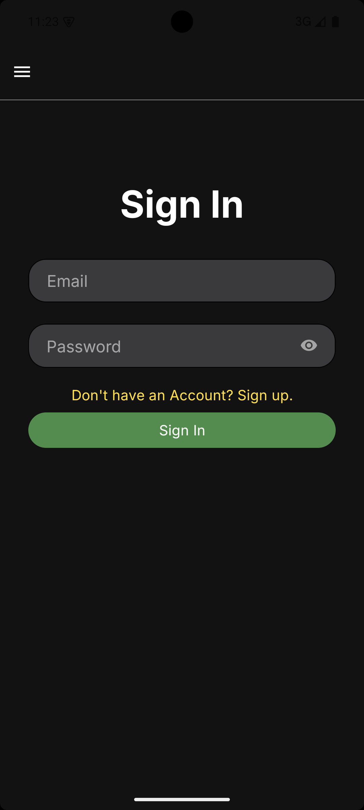
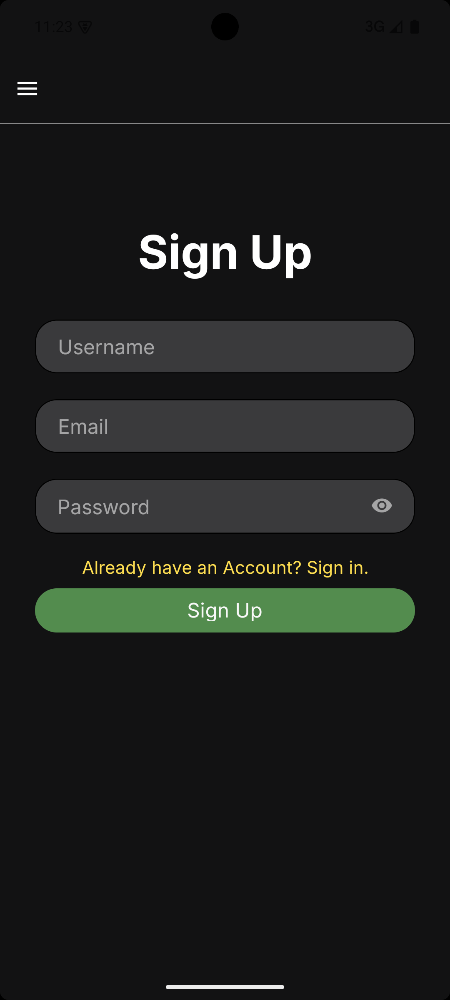
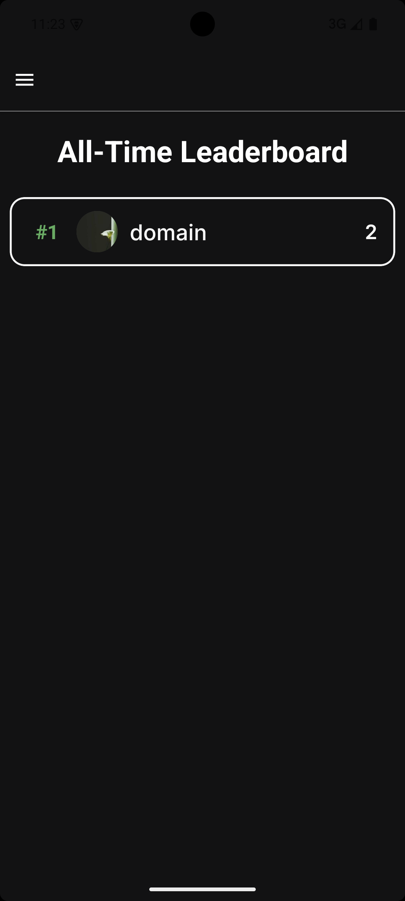
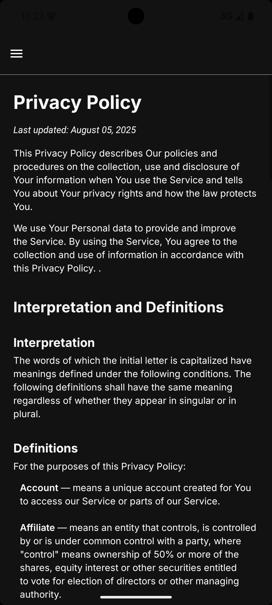

  

<h1 align="center" style="font-size: 52px; font-family: 'system-ui';"> Anydle </h1>

 
 
 
 <!--  -->
 

> [!NOTE]
> Download here: [**Google Play Store**](https://play.google.com/store/apps/details?id=com.daamin.anydle)

Anydle is an improved version of the famous daily game called Wordle by the New York Times. It keeps the 5-letter word guessing system, within 6 chances but adds a clean twist – **Categories**. In addition to the standard mode, you can choose from four presets : Tech, Science and Sports. When you pick a category, all possible answers relate only to that theme, making a new fun game mode. Instead of the daily word format, Anydle has an infinite word game mode – which never ends.

<!--
## Demo

Insert gif or link to demo -->

https://github.com/user-attachments/assets/8f47a7d4-b113-49d5-8638-fc28f3af5bb2

## Screenshots

|  |  |
| ------------------------------------ | ------------------------------------ |
|  |  |
|  |  |
|  |  |

## Feedback

If you have any feedback, please reach out to me at ashai.daamin@gmail.com

## Installation

Download the .apk from the latest Release.
App will also be published to the Play Store soon.

## Features

- Infinite Words instead of Daily
- Categories of words to guess from a Preset.
- Real-time Leaderboard
- Authentication with Email
- Account with Profile Pic and Username.
- Ability to custom generate a category (coming soon)
- Adding friends (coming soon)
- Multiplayer (coming soon)

## License

[CC BY-NC 4.0-Modified](https://creativecommons.org/licenses/by-nc/4.0/legalcode)

## Credits
Huge thank you to [@Dawar909](http://github.com/dawar909) for making the wonderful logo.
